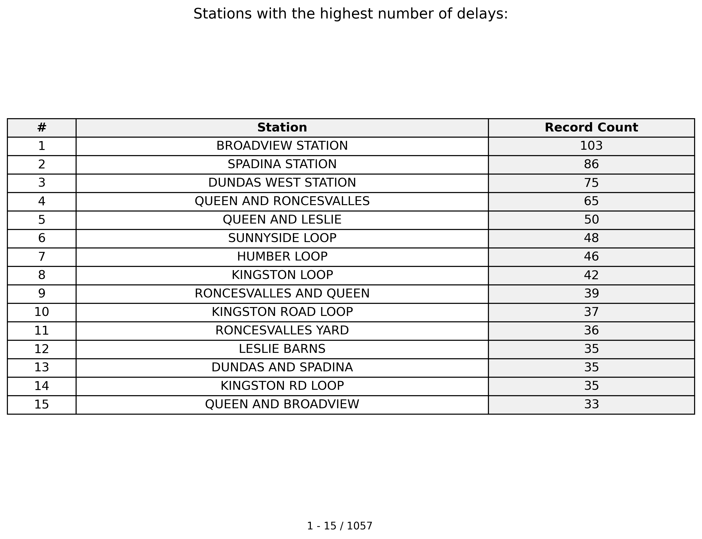
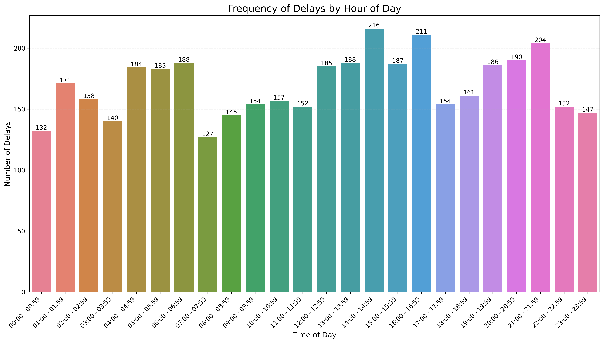
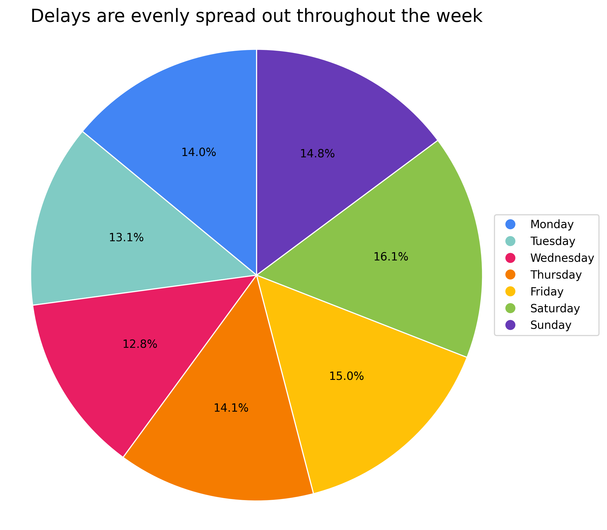
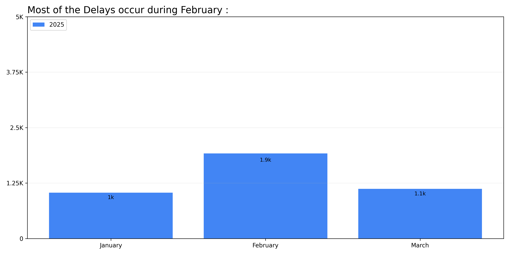
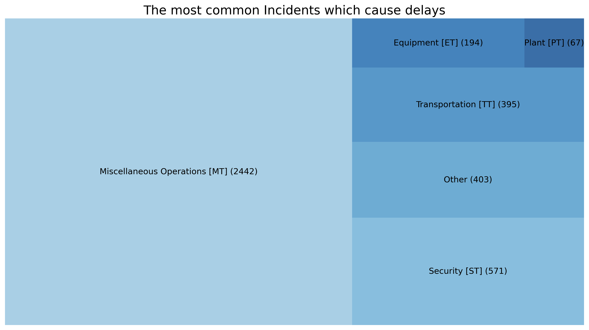
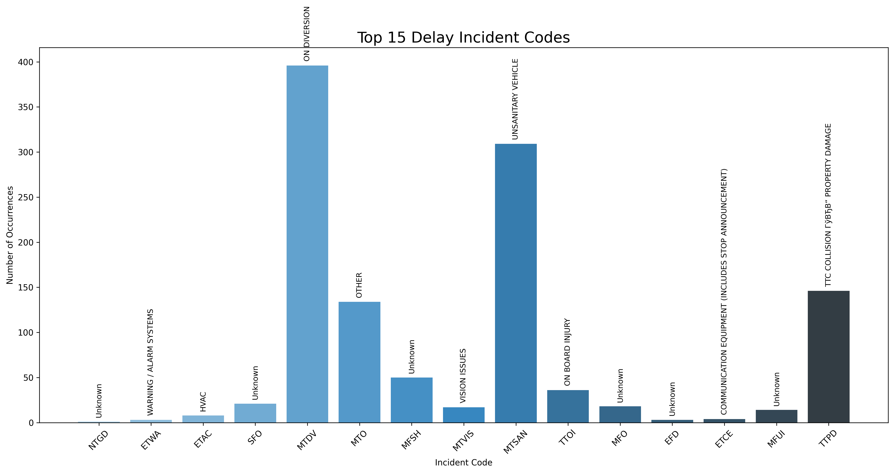

```{r setup, include=FALSE}
knitr::opts_chunk$set(echo = TRUE)
```

**Code and data available at:** https://github.com/AllysonCui/TTCStreetcarDelay


## Introduction

Public transit systems are essential infrastructure for urban mobility, and their reliability significantly impacts quality of life and economic productivity in cities. In Toronto, the streetcar network is a vital transportation artery serving thousands of commuters daily. However, like any transit system, it experiences service disruptions that affect its reliability [@diab2013].

Delay analysis is crucial for transit authorities to understand where, when, and why disruptions occur. Previous research has demonstrated that identifying patterns in transit delays can lead to more effective resource allocation and preventive maintenance strategies [@barron2013].

For the Toronto Transit Commission (TTC), which operates one of North America's largest streetcar networks, understanding delay patterns can lead to significant improvements in service reliability. According to the TTC's own service standards, maintaining consistent headways (time between vehicles) is a priority for passenger satisfaction [@ttc2024].

This paper analyzes TTC streetcar delay data from January to March 2025, seeking to:
1. Identify spatial patterns in delay occurrences
2. Analyze temporal trends, including time-of-day and day-of-week variations
3. Categorize and quantify the causes of delays
4. Provide data-driven insights for potential service improvements

By systematically examining these aspects, this study aims to contribute to the understanding of transit reliability challenges and inform strategies for enhancing service quality.

## Data

### TTC Streetcar Delay Data

The data used in this analysis comes from the Toronto Open Data Portal's "TTC Streetcar Delay Data" dataset, which provides detailed records of delay incidents across the TTC streetcar network. The dataset is published by the Toronto Transit Commission as part of their open data initiative.

| Field Name | Description | Example |
|------|-------------|------------|
| _id | Unique identifier for the record | 1 |
| Date | Date (YYYY/MM/DD) | 2025-01-01 |
| Line | TTC streetcar line | 504 KING |
| Time | Time (24h clock) | 02:10 |
| Day | Name of the day of the week | Wednesday |
| Station | TTC streetcar station/stop name | KING AND PARLIAMENT |
| Code | TTC delay code | MTSAN |
| Min Delay | Delay (in minutes) to the schedule for the following vehicle | 10 |
| Min Gap | Time length (in minutes) from the vehicle ahead | 20 |
| Bound | Direction of the route | W |
| Vehicle | Vehicle number | 4569 |

The first record indicates a 10-minute delay on the 504 King streetcar line at King and Parliament on Wednesday, January 1, 2025, at 2:10 AM, with a delay code of MTSAN (Unsanitary Vehicle).

### Delay Codes and their Descriptions

A supplementary dataset provides descriptions for the delay codes, with fields:

| Field Name  | Description                         | Example                           |
|--------------------|----------------------------------|-----------------------------------|
| _id         | Unique identifier for the code      | 6                                 |
| CODE        | Delay code                          | ETCE                              |
| DESCRIPTION | Humanized description for the code  | COMMUNICATION EQUIPMENT<br>(INCLUDES STOP ANNOUNCEMENT) |

The delay codes are categorized with prefixes that indicate the general category of the delay:

- **ET**: Equipment-related delays
- **MT**: Miscellaneous operations-related delays
- **PT**: Plant-related delays (infrastructure)
- **ST**: Security-related delays
- **TT**: Transportation-related delays

It's important to note that the directory on delay codes does not contain explanations for all codes mentioned in the delay data. Specifically, codes that start with 'EF', 'MF', 'SF', 'TF', or 'PF' are not explained in the reference dataset. This limitation means that some delay causes in our analysis remain without detailed descriptions.

### Data Processing and Analysis

The data processing pipeline for this analysis involved several steps:

1. Obtaining the raw data from Toronto's Open Data Portal using their API. Data from previous years are in xlsx format and couldn't be automatically extracted by API.

2. Merging the delay incidents with their corresponding code descriptions, handling malformed characters, and standardizing formats.

3. Deriving new features including hour of day and categorical grouping of delay codes.

4. Performing various aggregations to identify patterns across time, space, and delay categories.

5. Creating informative visualizations to represent the findings.

Python was used for all data processing and analysis, with pandas for data manipulation, matplotlib and seaborn for visualization, and specialized libraries like squarify for treemap visualizations. The analysis scripts were structured to follow a consistent pattern of loading, processing, analyzing, and visualizing the data.

## Results

### Spatial Distribution of Delays

The spatial analysis reveals key problem areas in the TTC streetcar network (Figure 1). Three major stations account for 25% of all location-specific delays: Broadview Station (103 delays), Spadina Station (86 delays), and Dundas West Station (75 delays). These are all major transfer points where multiple routes connect.



*Figure 1: Top 15 stations with the highest number of delays.*

Terminal loops also show high delay rates, with Sunnyside Loop (48 delays), Humber Loop (46 delays), and Kingston Loop (42 delays) all appearing in the top 10.
The east side of the network appears to have more delay hotspots than the west side, with several major delay locations (Broadview Station, Kingston Loop) in the eastern portion of the network. This may indicate differences in infrastructure quality or operational practices between these areas.

### Temporal Patterns

#### Time of Day Analysis

The hourly delay distribution challenges typical assumptions about when transit is most reliable (Figure 2). Delays peak at 2-3 PM (216 delays) and 8-9 PM (204 delays), not during traditional rush hours.



*Figure 2: Distribution of delay incidents by hour of day.*

The 2-3 PM peak occurs before the afternoon rush, suggesting that preparing for peak service may encounter more problems than handling peak crowds. The 8-9 PM peak happens when supervisor coverage is typically reduced, which may explain the higher delay rates. Early morning hours (4-6 AM) show consistent delays despite low ridership and traffic. This points to internal issues like vehicle deployment and staff availability at the start of service.

The relatively small variation between hours suggests that delay factors are present throughout the day rather than being strongly tied to specific peak periods.

#### Day of Week Distribution

Delays occur at similar rates across all days of the week (Figure 3), with Saturday showing only slightly more delays (16.1%) than the lowest day, Wednesday (12.8%).



*Figure 3: Distribution of delays by day of the week.*

This pattern challenges the common practice of reducing resources on weekends. With weekend days accounting for nearly one-third of all delays, and fewer staff typically scheduled on weekends, each delay may have greater impact due to reduced response capacity.

#### Monthly Trends

February shows nearly twice as many delays (1,900) as January (1,000) or March (1,100), as seen in Figure 4.



*Figure 4: Distribution of delays by month in 2025.*

This February spike likely reflects the accumulated effects of winter conditions. While January brings the initial winter weather, February combines sustained cold, built-up snow and ice, and ongoing salt damage to infrastructure. The decrease in March suggests some recovery as conditions improve, though delay levels remain higher than January.

### Delay Causes

#### Categories of Delay Incidents

The analysis of delay types shows that operational issues, not equipment failures, are the main problem (Figure 5).



*Figure 5: Treemap showing the distribution of delay incidents by category.*

Miscellaneous Operations [MT] account for 60% of all delays (2,442 incidents), far outweighing equipment problems. Security issues [ST] cause 14% of delays (571 incidents), showing how passenger behavior significantly impacts service.
Equipment failures [ET] (194 incidents, 5%) and infrastructure issues [PT] (67 incidents, 2%) are relatively minor factors, suggesting that vehicle and track reliability are not the main problems.

#### Specific Delay Codes

Looking at specific delay codes reveals more detail about what causes service disruptions (Figure 6).



*Figure 6: Bar chart showing the top 15 delay incident codes by frequency.*

Just four types of incidents account for over 40% of all delays:

1. **Auto Foul Rail (MTAFR)**: Over 650 incidents where vehicles encounter track obstructions
2. **On Diversion (MTDV**): About 400 incidents where vehicles must detour from normal routes
3. **Disorderly Patron (STDP)**: Over 300 incidents involving passenger behavior issues
4. **Unsanitary Vehicle (MTSAN)**: Over 300 incidents requiring vehicle cleaning

This analysis reveals that Toronto's streetcar system struggles most with its operations at the street level. Physical obstacles in tracks, necessary route changes due to construction, passenger-related disruptions, and vehicle cleanliness issues collectively create more service problems than mechanical failures. This suggests that reliability improvements should focus on street-level operations and passenger management rather than solely pursuing vehicle or infrastructure upgrades.

## Discussion

Delays cluster at major stations like Broadview, Spadina, and Dundas West where many routes connect. These busy transfer points need special attention, including better staff training and smarter scheduling. Loop terminals such as Humber, Kingston, and Sunnyside also show high delay rates, suggesting problems with turn-around operations that can affect the entire system.

The times with most delays aren't the usual rush hours. Most problems happen from 2-3 PM when service transitions to evening peak, and again from 8-9 PM when fewer supervisors are working. Early morning (4-6 AM) also shows many delays despite light traffic, pointing to issues with getting vehicles and crews ready for the day. February's higher delay rate shows how winter conditions build up over time, calling for better winter maintenance and possibly more staff during cold months.

Most delays come from everyday operational issues rather than broken equipment. Track blockages and route changes due to construction cause the most disruptions, suggesting we need better track maintenance and smoother handling of diversions. Passenger behavior also causes significant delays, showing that better customer management could improve service. While equipment problems cause fewer delays, targeted maintenance could still help, especially at trouble spots and during problem times.

## Limitations and Future Research

This analysis has several limitations that should be acknowledged:

1. The three-month time frame (January-March 2025) may not capture seasonal variations throughout the entire year.
2. The lack of explanation for certain delay codes (those beginning with 'EF', 'MF', 'SF', 'TF', or 'PF') limits our understanding of some delay categories.

Future research could address these limitations by:

1. Extending the analysis to a full year of data to capture seasonal patterns
2. Incorporating geographical data to better visualize the clusters
3. Conducting comparative analysis with previous years to identify trends over time
4. Investigating the relationship between weather conditions and specific delay types

## References